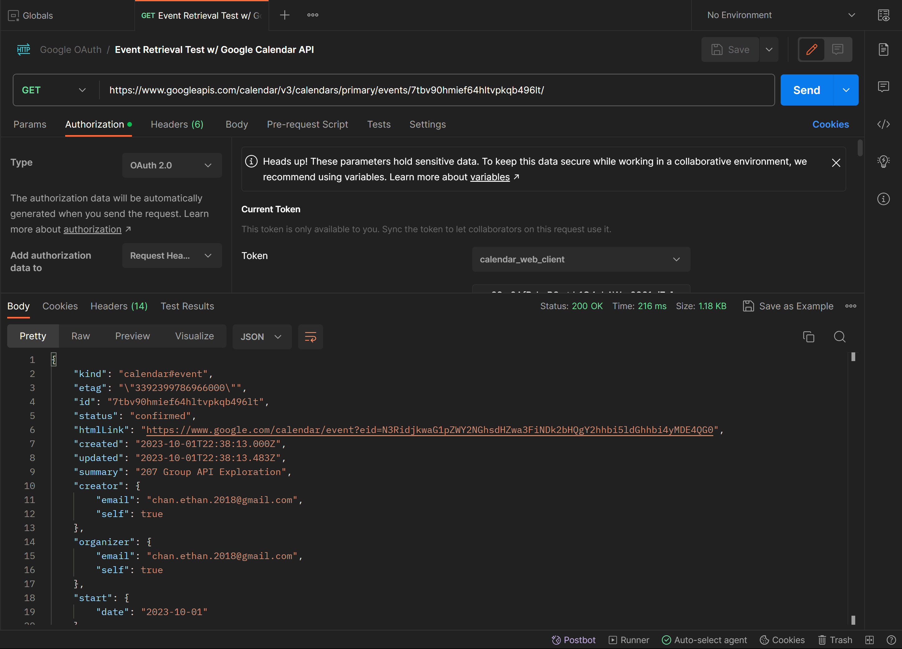

# Calendar Organizer
A calendar organization tool built with Google's Calendar API
(documentation can be found [here](https://developers.google.com/resources/api-libraries/documentation/calendar/v3/java/latest/))

## Problem Domain: Calendar Organizer
- represent events/tasks
- be able to assign tags and extra information to each task (e.g. importance, subject, due date, etc.)
- allow users to create/edit/delete events
- visualize/sort tasks by tags and extra information
- provide an overview of the information (e.g. upcoming tasks, events for the day, etc.)
- use Google's Calendar API to store data as events

# Application Overview
We intend to create an app that will integrate with a user's existing Google Calendar, and allow them to 
visualize/organize it in alternative ways that ideally will be more conducive towards an efficient workflow, and getting 
an overall sense of upcoming tasks that require attention. A user should be able to rely solely on our application, and
directly create/delete/complete tasks from within. As a result, we hope to accommodate extra functionality, including 
the ability to specify additional parameters (e.g. subject, task type, indoors/outdoors, etc.), which we will store in 
the user's Google Calendar using a specific text formatting. Finally, to tie everything together, we will attempt to 
provide a holistic overview of the user's upcoming tasks, events for the day, and perhaps even performance metrics.

# Postman API Test Call

This is an example call to the Google Calendar API to retrieve the information about an example event. 

## To run the Java API test code:
1. Install Gradle at https://gradle.org/
2. At https://console.cloud.google.com/, create a new project, go to APIs & Services, click `Enable APIs and Services`,
   find the Google Calendar API, enable it, then click `Create Credentials`, and follow the instructions.
3. On your Google Project page, navigate to the OAuth consent screen and add your email as a test user.
2. Download the JSON file, and rename it to `credentials.json`.
3. After cloning this repo, replace the `CREDENTIAL_FILE_HERE.json` file in `src/main/resources` with your actual credential
   file.
4. Then run `gradle run` in the terminal, and authenticate with Google.
5. You can now run the CalendarAPITest class.
